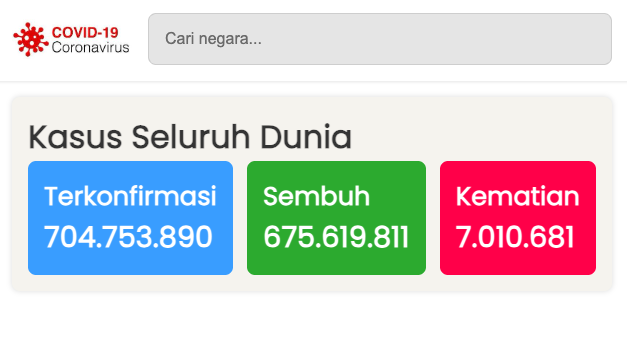

<p align="center">
  <a href="#">
    
  </a>
</p>

<h1 align="center">COVID-19 Dashboard – Ringkasan Global & Negara</h1>

<p align="center">
  Aplikasi web sederhana untuk melihat ringkasan kasus COVID-19 secara global dan per negara, lengkap dengan pencarian negara.
  <br/>
  <a href="#penggunaan"><strong>Lihat cara penggunaan »</strong></a>
  <br/>
  <br/>
  <a href="#instalasi">Instalasi</a>
  ·
  <a href="#kontribusi">Kontribusi</a>
  ·
  <a href="#lisensi">Lisensi</a>
</p>

---

## Daftar Isi
- [Deskripsi](#deskripsi)
- [Fitur](#fitur)
- [Tech Stack](#tech-stack)
- [Instalasi](#instalasi)
  - [Prasyarat](#1-prasyarat)
  - [Clone & Dependensi](#2-clone--dependensi)
  - [Jalankan Lokal](#3-jalankan-lokal)
  - [Build untuk Produksi](#4-build-untuk-produksi)
- [Penggunaan](#penggunaan)
- [Tangkapan Layar](#tangkapan-layar)
- [Struktur Proyek](#struktur-proyek)
- [Kontribusi](#kontribusi)
- [Lisensi](#lisensi)
- [Ucapan Terima Kasih](#ucapan-terima-kasih)

## Deskripsi
<p align="center">
  
  <br/>
</p>

Aplikasi ini menampilkan ringkasan data COVID-19 (terkonfirmasi, sembuh, kematian) secara global dan memungkinkan pengguna memilih negara tertentu untuk melihat datanya. Data diambil dari API publik yang aktif.

- API saat ini: `https://disease.sh/v3/covid-19`
- Endpoint yang dipakai:
  - Global summary: `/all`
  - Daftar negara: `/countries`
  - Detail negara (ISO3): `/countries/{ISO3}?strict=true`

## Fitur
- Ringkasan global (terkonfirmasi, sembuh, kematian)
- Pencarian dan pemilihan negara (berdasarkan nama)
- Tampilan angka dengan pemformatan ribuan
- Komponen web ringan (tanpa framework besar)

## Tech Stack
<p>
  
  
  
  
  
</p>

## Instalasi

### 1) Prasyarat
- Node.js 12+ (disarankan 14/16/18)
- npm 6+

### 2) Clone & Dependensi
```bash
git clone https://github.com/<kamu>/covid-19.git
cd covid-19
npm install
```

### 3) Jalankan Lokal
```bash
npm run dev
# buka http://localhost:8080
```

### 4) Build untuk Produksi
```bash
npm run build
# output akan berada di folder dist/
```

## Penggunaan
- Buka halaman utama.
- Gunakan kolom pencarian untuk mengetik nama negara, lalu pilih salah satu dari daftar.
- Ringkasan akan otomatis menampilkan data global saat awal dan data negara saat dipilih.

Catatan: Jika API publik mengalami gangguan, aplikasi mungkin menampilkan status "loading" atau tidak memuat data. Endpoint telah dimigrasikan ke `disease.sh` dari `mathdro` yang sudah tidak aktif.

## Tangkapan Layar
Tambahkan screenshot UI Anda di sini jika diperlukan.

## Struktur Proyek
```
.
├─ package.json
├─ src/
│  ├─ app.js
│  ├─ index.html
│  ├─ assets/
│  │  └─ logo/
│  │     └─ covid-19-logo.jpeg
│  ├─ scripts/
│  │  ├─ components/
│  │  │  ├─ nav-bar-covid.js
│  │  │  ├─ covid-box-summary.js
│  │  │  ├─ covid-country-search.js
│  │  │  ├─ covid-country-list.js
│  │  │  ├─ covid-country-item.js
│  │  │  └─ covid-country-input-search.js
│  │  ├─ config/
│  │  │  └─ index.js            # Konfigurasi endpoint API (disease.sh)
│  │  ├─ data/
│  │  │  └─ data-covid.js       # Abstraksi fetch + mapping data
│  │  └─ utils/
│  │     ├─ event-bus.js
│  │     └─ thousandFormat.js
│  └─ styles/
│     └─ style.css
└─ webpack/
   ├─ webpack.common.js
   ├─ webpack.dev.js
   └─ webpack.prod.js
```

## Kontribusi
1. Fork repository dan buat branch fitur/bugfix.
2. Lakukan perubahan dengan commit message yang jelas.
3. Pastikan tidak ada secret yang ter-commit.
4. Buka Pull Request dan jelaskan perubahan Anda.

## Lisensi
MIT License.

## Ucapan Terima Kasih
- Data: `disease.sh` COVID-19 API (`https://disease.sh`)
- Inspirasi API awal: `covid19.mathdro.id` (sudah tidak aktif)
- Template README yang menginspirasi struktur bagian.


